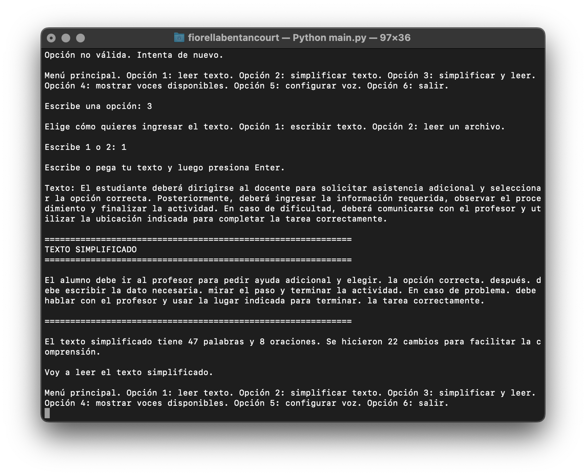

<div align="center">

# 🧩 Accessible Text Helper


**A Python-based tool that simplifies text, improves readability, and enhances accessibility for users with different reading needs.**
**Una herramienta en Python que simplifica texto, mejora la legibilidad y facilita el acceso a contenido para diferentes tipos de usuarios.**

</div>

---

## 📸 Demo

<p align="center">
  
</p>

---

## ✨ Key Highlights

* Real-world accessibility-focused tool
* Text simplification and readability improvement
* Designed for inclusive content consumption
* Modular Python architecture
* Focused on practical usability

---

## 🇬🇧 English

### 📌 Overview

This project is a Python-based command-line application designed to simplify and transform text into more accessible formats.

It helps improve readability by reducing complexity, restructuring sentences, and preparing content for different types of users, including those with learning or cognitive challenges.

---

### ⚙️ Features

* Simplifies complex text into more readable formats
* Detects and processes long or complex sentences
* Enhances clarity and structure of written content
* Optional text-to-speech functionality
* Command-line interface for easy interaction

---

### 🧠 Technologies

* Python 3
* Text processing (string manipulation, regex)
* Text-to-Speech (TTS)
* Modular architecture

---

### ▶️ Installation and Usage

```bash id="2i9rcq"
pip install -r requirements.txt
python3 main.py
```

Then input the text you want to simplify.

---

### 🎯 Purpose

This project was created to:

* Improve content accessibility
* Support inclusive reading experiences
* Explore text processing in Python
* Build practical tools with real-world applications

---

### ⚠️ Limitations

* Simplification is rule-based and not AI-driven
* Context understanding may be limited
* Results may vary depending on text complexity

---

### 🚀 Future Improvements

* NLP-based text simplification
* Multiple language support
* Improved sentence restructuring
* Integration with accessibility tools

---

## 🇪🇸 Español

### 📌 Descripción

Este proyecto es una aplicación en Python diseñada para simplificar textos y hacerlos más accesibles.

Permite mejorar la legibilidad reduciendo la complejidad, reorganizando frases y facilitando la comprensión para diferentes tipos de usuarios, incluyendo personas con dificultades de lectura o cognitivas.

---

### ⚙️ Funcionalidades

* Simplifica textos complejos
* Detecta y procesa oraciones largas
* Mejora la claridad y estructura del contenido
* Funcionalidad opcional de texto a voz
* Interfaz por línea de comandos

---

### 🧠 Tecnologías

* Python 3
* Procesamiento de texto
* Text-to-Speech
* Arquitectura modular

---

### ▶️ Instalación y uso

```bash id="fkrubk"
pip install -r requirements.txt
python3 main.py
```

Luego ingresa el texto que deseas simplificar.

---

### 🎯 Objetivo

Este proyecto fue creado para:

* Mejorar la accesibilidad del contenido
* Facilitar la lectura
* Explorar procesamiento de texto en Python
* Desarrollar herramientas con impacto real

---

### ⚠️ Limitaciones

* La simplificación es basada en reglas (no IA)
* Puede no interpretar contexto complejo
* Resultados dependen del texto de entrada

---

### 🚀 Mejoras futuras

* Integración con modelos NLP
* Soporte multi-idioma
* Mejora en la simplificación de texto
* Integración con otras herramientas de accesibilidad

---

## 👩‍💻 Author

Fiorella Bentancourt
https://github.com/bentancourtfiorellanahir-bot
